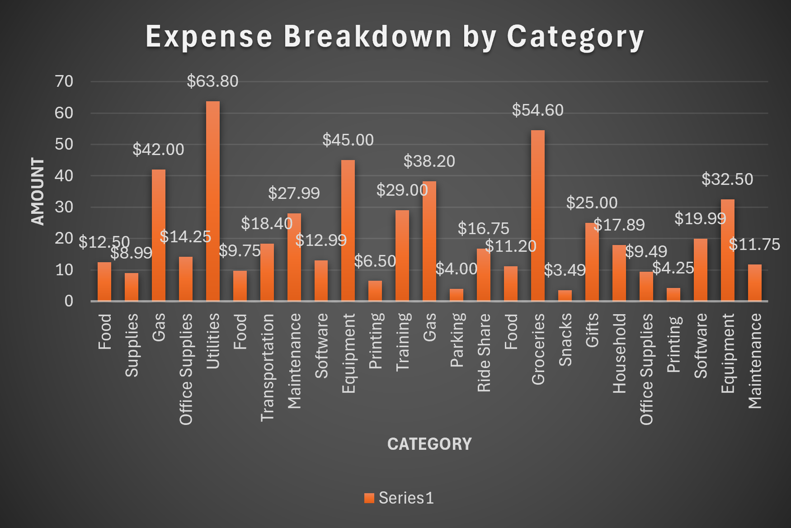
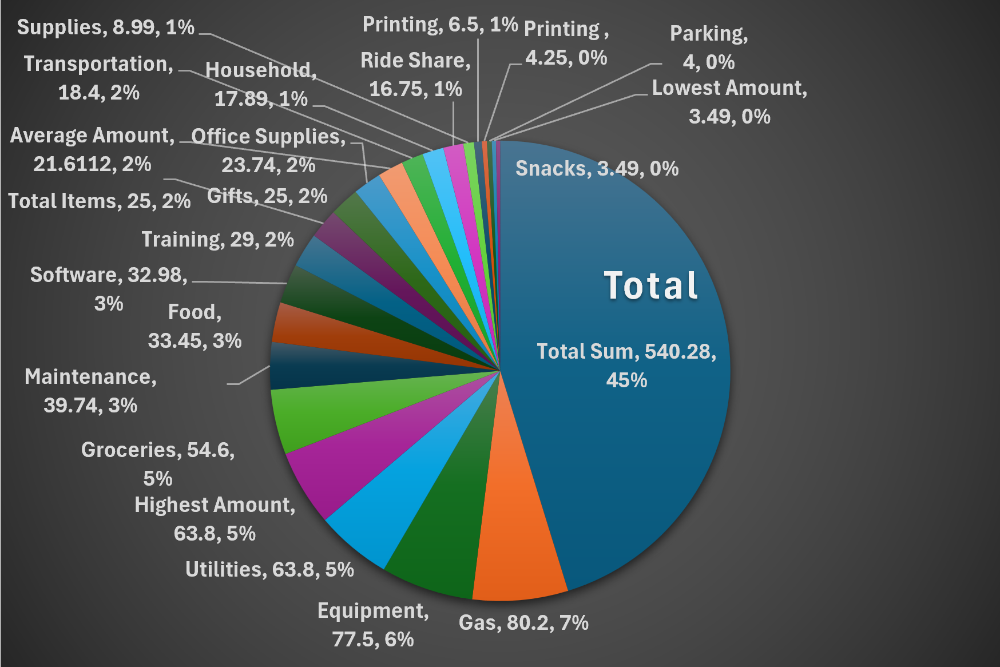

📊 Excel Expense Tracker
A complete Excel-based financial tracking tool designed to monitor spending, categorize expenses, and visualize financial habits using summary metrics and charts.

🔍 Overview
This project uses ExcelProject_v1.0.0.xlsx as the main workbook. It includes:

A structured expense log

Automatic calculations for totals, averages, highs/lows

Category-based spending analysis

Two visual dashboards (bar chart + pie chart)

This demonstrates practical Excel skills used in budgeting and data analysis.

🧩 Features
Dynamic Expense Table (Date, Category, Description, Amount, Notes)

Summary Metrics

Total Amount: $540.28

Average Amount: $21.61

Highest Amount: $63.83

Lowest Amount: $3.49

Total Items: 25

Category Breakdown

Conditional Formatting

Pivot-style analysis

📈 Visuals
Below are the visuals from ExcelProject_v1.0.0.xlsx.
### Expense Breakdown by Category

### Total Expense Distribution (Pie Chart)

📁 Files Included
ExcelProject_v1.0.0.xlsx

Chart screenshots (uploaded separately)

🎯 Purpose
This project highlights your ability to:

Build structured Excel tools

Create automated financial summaries

Visualize spending patterns

Present clean, professional dashboards

You can expand this project by exploring pivot tables or monthly dashboards.
